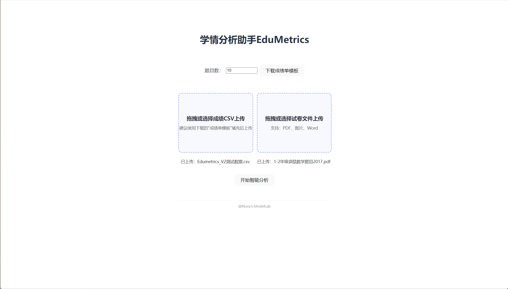
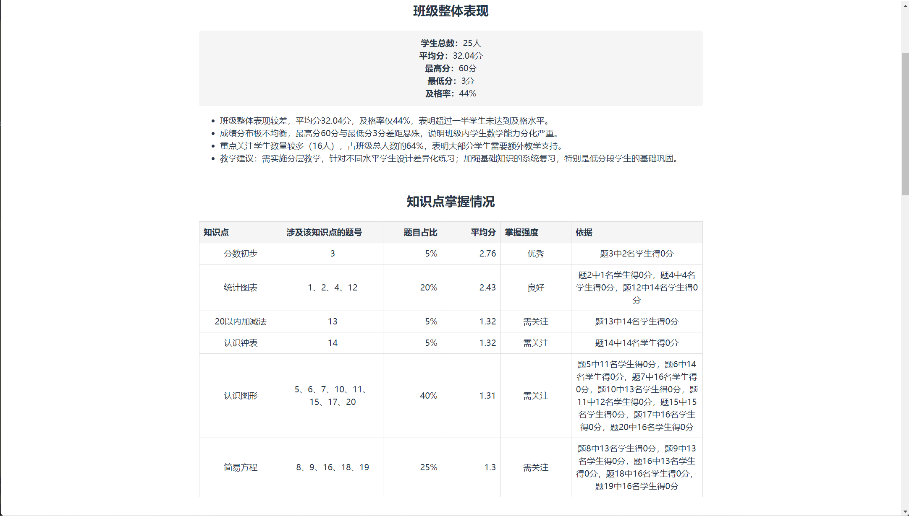
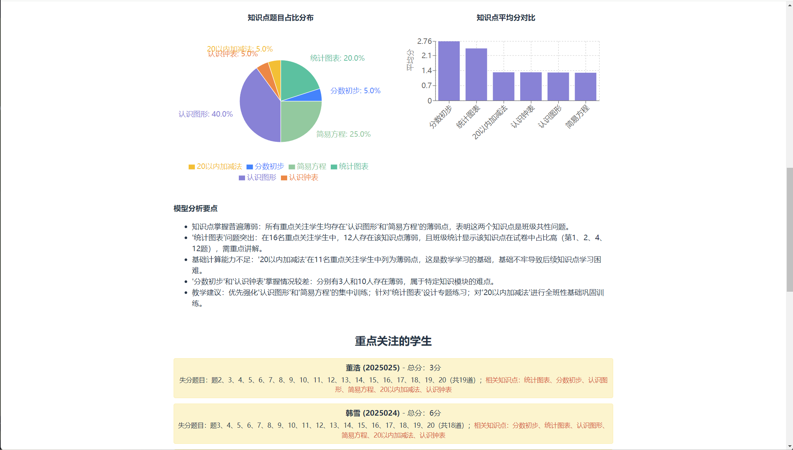

# EduMetrics
备注：该版本为Demo版，仅支持1-2年级数学试卷及成绩分析。

一个基于 React + Vite 构建的智能学情分析平台，通过 AI 技术帮助教师快速分析学生成绩数据，生成专业的学情分析报告。备注：该版本为Demo版，仅支持1-2年级数学试卷及成绩分析。

## 📸 项目预览







## ✨ 功能特性

### 📊 数据上传与分析
- **成绩数据上传**：支持 Excel (.xlsx) 和 CSV 格式的成绩文件
- **试卷上传**：支持 Word (.docx) 和 PDF 格式的试卷文件
- **智能解析**：自动提取学生成绩、题目得分、知识点信息
- **编码兼容**：自动处理 GBK/UTF-8 编码问题

### 🤖 AI 智能分析
- **班级整体分析**：自动计算班级平均分、及格率、优秀率等统计指标
- **知识点掌握分析**：基于试卷知识点映射，分析各知识点掌握情况
- **重点关注学生**：自动识别需要重点关注的学生，提供个性化分析
- **薄弱知识点识别**：精准识别学生薄弱知识点，提供改进建议
- **语义分析报告**：使用 DeepSeek AI 生成专业的教学建议和诊断分析

### 📈 报告生成
- **可视化展示**：清晰的图表和统计数据显示
  - 知识点题目占比分布（饼图）
  - 知识点平均分对比（柱状图）
- **知识点分布**：展示试卷知识点覆盖情况
- **学生排名**：按成绩排序，一目了然
- **PDF报告导出**：支持导出专业的PDF分析报告，包含完整的分析结果和可视化图表

## 🛠️ 技术栈

- **前端框架**：React 19
- **构建工具**：Vite 7
- **路由管理**：React Router v7
- **文件处理**：
  - `mammoth` - Word 文档解析
  - `pdfjs-dist` - PDF 文档解析
  - `tesseract.js` - OCR 文字识别
- **数据可视化**：
  - `recharts` - 图表组件库（饼图、柱状图）
- **PDF生成**：
  - `jspdf` - PDF 生成库
  - `html2canvas` - HTML转图片工具
- **AI 集成**：DeepSeek API

## 📦 安装与运行

### 环境要求
- Node.js >= 16.0.0
- npm >= 7.0.0

### 安装依赖

```bash
npm install
```

### 环境变量配置

1. 复制环境变量模板文件：
```bash
cp .env.example .env
```

2. 编辑 `.env` 文件，填入你的 DeepSeek API Key：
```env
VITE_DEEPSEEK_API_KEY=your_deepseek_api_key_here
```

**获取 API Key：**
- 访问 [DeepSeek 平台](https://platform.deepseek.com/api_keys)
- 注册/登录账号
- 创建 API Key 并复制

> 💡 **试用说明**：如果没有配置 API Key，系统会自动使用模拟数据进行演示，可以体验基本功能，但 AI 分析功能将使用预设的示例数据。

### 启动开发服务器

```bash
npm run dev
```

访问 `http://localhost:5173` 查看应用

### 构建生产版本

```bash
npm run build
```

### 预览生产版本

```bash
npm run preview
```

## 📁 项目结构

```
Edumetrics_V2/
├── docs/
│   ├── samples/            # 测试文件
│   │   ├── sample-scores.csv  # 示例成绩文件
│   │   └── sample-paper.pdf   # 示例试卷文件
│   └── screenshots/       # 项目截图
├── src/
│   ├── pages/              # 页面组件
│   │   ├── UploadPage.jsx  # 文件上传页面
│   │   └── AnalysisPage.jsx # 分析结果页面
│   ├── context/            # Context API
│   │   └── UploadContext.jsx # 上传状态管理
│   ├── services/           # 业务逻辑服务
│   │   ├── parse.js        # 文件解析
│   │   ├── paperExtract.js # 试卷提取
│   │   ├── standards.js    # 标准知识点
│   │   ├── statsCalculator.js # 统计分析
│   │   ├── deepseek.js     # AI 分析接口
│   │   ├── knowledge.js    # 知识点处理
│   │   ├── template.js     # 模板生成
│   │   └── export.js       # 导出功能
│   ├── App.jsx             # 主应用组件
│   └── main.jsx            # 入口文件
├── public/                 # 静态资源
└── package.json            # 项目配置
```

## 🚀 使用指南

### 快速开始（使用测试文件）

项目提供了测试文件，方便快速体验功能：

1. 进入项目目录的 `docs/samples/` 文件夹
2. 上传 `sample-scores.csv`（成绩文件）
3. 上传 `sample-paper.pdf`（试卷文件，可选）
4. 点击"开始分析"即可查看分析结果

### 1. 上传成绩文件
- 在首页上传 Excel 或 CSV 格式的成绩文件
- 文件格式要求：
  - CSV：包含学生姓名、班级、各题得分等列
  - Excel：支持标准成绩表格式
- 系统会自动解析并显示数据摘要
- 💡 **提示**：可以使用 `docs/samples/sample-scores.csv` 作为示例文件

<!--  -->

### 2. 上传试卷文件（可选）
- 上传 Word 或 PDF 格式的试卷文件
- 系统会自动提取题目内容，用于知识点识别
- 如果未上传试卷，可手动设置题目数量
- 💡 **提示**：可以使用 `docs/samples/sample-paper.pdf` 作为示例文件

### 3. 开始分析
- 点击"开始分析"按钮
- 系统会：
  1. 识别试卷知识点（如已上传试卷）
  2. 计算各项统计数据
  3. 调用 AI 生成分析报告
- 分析完成后，查看详细的分析结果

### 4. 查看分析报告
- **班级整体表现**：平均分、及格率、优秀率等
- **知识点掌握情况**：各知识点的正确率分析
- **重点关注学生**：低分学生列表及薄弱知识点
- **教学建议**：AI 生成的针对性改进建议

<!--  -->

## 🔧 开发说明

### 核心功能模块

- **文件解析服务** (`services/parse.js`)：处理 Excel/CSV 文件，提取成绩数据
- **试卷提取服务** (`services/paperExtract.js`)：从 Word/PDF 中提取题目内容
- **统计分析服务** (`services/statsCalculator.js`)：计算各项统计数据
- **AI 分析服务** (`services/deepseek.js`)：调用 DeepSeek API 生成分析报告
- **知识点服务** (`services/standards.js`)：标准知识点定义和映射

### 数据流

1. 用户上传文件 → 文件解析 → 数据提取
2. 试卷提取 → 知识点识别（AI）
3. 成绩数据 + 知识点映射 → 统计分析
4. 统计数据 → AI 分析 → 生成报告

## 📝 注意事项

### API Key 配置
- **首次使用**：需要配置 DeepSeek API Key 才能使用完整的 AI 分析功能
- **试用模式**：未配置 API Key 时，系统会使用模拟数据，可以体验界面和基本功能
- **安全提醒**：请勿将 `.env` 文件提交到 Git 仓库，`.env.example` 是安全的模板文件

### 使用建议
- 大文件处理可能需要较长时间，请耐心等待
- 支持的文档格式：.xlsx, .csv, .docx, .pdf
- 建议使用标准格式的成绩表，以确保数据正确解析
- 如果遇到编码问题（中文乱码），系统会自动尝试 GBK 编码

## 🤝 贡献

欢迎提交 Issue 和 Pull Request！

## 📄 许可证

本项目采用 MIT 许可证

## 🔗 相关链接

- [React 文档](https://react.dev/)
- [Vite 文档](https://vite.dev/)
- [DeepSeek API](https://api.deepseek.com/)
